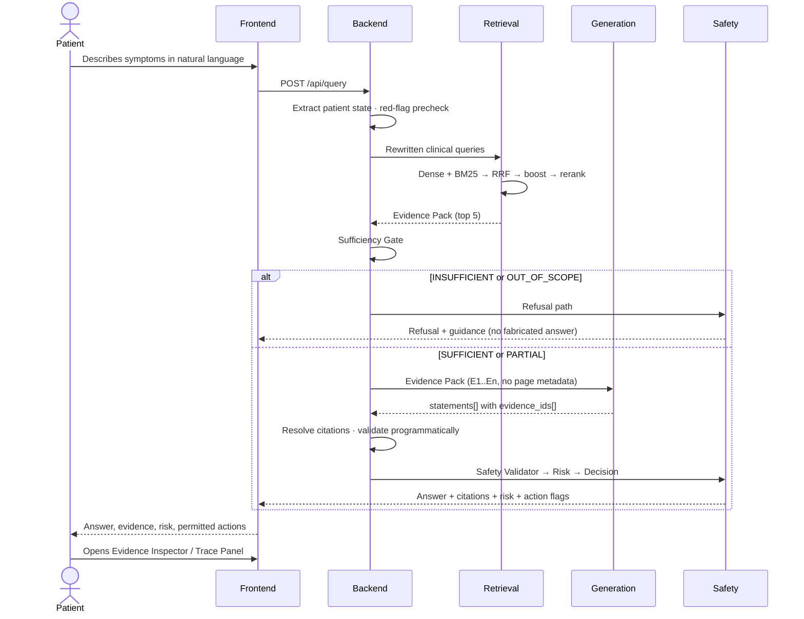

# SPEC.md — Technical & Functional Specification

**Project:** Evidence-Grounded AI Clinical Decision Support Lite — deployed as **فقراتي (Faqarati)**
**Version:** 2.0 · **Status:** **As-built** on branch `feat/qwen3-embedding-and-deploy` — Parts A–G are the approved v1.0 specification (requirement IDs frozen); **Part H records every as-built variance**, and Parts B.9–B.11, D.11, and F.8–F.9 add the requirements this branch implemented beyond v1.0. Where Part H contradicts an earlier part, Part H is the truth.
**Live deployment:** https://fatimahemadeldin-clinical-decision-support-rag.hf.space
**Companions:** [ARCHITECTURE.md](ARCHITECTURE.md) (§23 = as-built) · [PLAN.md](PLAN.md) · [PROJECT-STATE.md](PROJECT-STATE.md) · [TODO-PRODUCTION.md](TODO-PRODUCTION.md) · [README.md](README.md)

> **Requirement notation**
> **[GUIDE]** — mandated by the official hackathon PDF
> **[TEAM]** — this team's design decision, not a mandate
> `MUST` / `SHOULD` / `MAY` — RFC 2119 sense
> Requirement IDs are stable. Cite them in commits, tests, and issues.

---

# PART A — PRODUCT REQUIREMENTS

## A.1 Problem Statement

Large Language Models produce fluent medical advice that is frequently unsupported or fabricated
**[GUIDE]**. A patient describing symptoms to a general-purpose chatbot receives confident prose
with no way to distinguish a real guideline recommendation from a plausible invention.

Three failures compound in a medical setting:

1. **Unverifiable claims.** The user cannot check what a statement was based on.
2. **Confident wrongness.** No signal distinguishes a well-supported answer from a guess.
3. **Missing refusal.** The model answers even when it has nothing to answer from — most dangerous
   precisely when the question is unusual or urgent.

## A.2 Objectives

| ID | Objective |
|---|---|
| **OBJ-1** | **[GUIDE]** Ingest official medical guideline PDFs into a searchable, citation-preserving index |
| **OBJ-2** | **[GUIDE]** Retrieve only relevant, high-quality evidence for a clinical query |
| **OBJ-3** | **[GUIDE]** Generate responses strictly grounded in retrieved evidence |
| **OBJ-4** | **[GUIDE]** Provide transparent citations — document name, section, page |
| **OBJ-5** | **[GUIDE]** Refuse when evidence is insufficient or the query is out of scope |
| **OBJ-6** | **[TEAM]** Classify urgency into four levels with an explainable rationale (D3) |
| **OBJ-7** | **[TEAM]** Route the user to a deterministic, appropriate next action (D3) |
| **OBJ-8** | **[TEAM]** Expose the full reasoning chain from input to action |

## A.3 Target Users

**Primary — a patient describing symptoms** (decision D2). Writes in lay language, has no clinical
training, and may be under stress.

D2's consequence, stated plainly: the corpus is written for clinicians, so a vocabulary gap exists
between query and evidence. The Query Rewriter (**FR-3.2**) exists specifically to close it, and the
evaluation set is authored in patient voice (**RAG-9.3**) so the gap is measured rather than assumed
away.

**Secondary — hackathon judges** evaluating retrieval precision, grounding, architecture, evaluation
rigor, and safety. The Evidence Inspector and Trace Panel serve this user directly.

**Explicitly not a user:** a clinician making a treatment decision. This system is a demonstrator on
synthetic data, not a validated clinical tool.

## A.4 Core Use Cases

| ID | Use case | Expected behavior |
|---|---|---|
| **UC-1** | Acute symptom, strong evidence | Grounded answer, citations, `HIGH`/`CRITICAL` risk, emergency workflow |
| **UC-2** | Non-acute symptom needing evaluation | Grounded answer, `MODERATE` risk, evaluation recommended, escalation warning signs |
| **UC-3** | Prevention/lifestyle question | Grounded USPSTF answer with evidence grades, `LOW` risk |
| **UC-4** | Query outside all supported domains | `OUT_OF_SCOPE` refusal, no fabricated answer |
| **UC-5** | In-domain query with weak retrieval | `INSUFFICIENT` refusal, recommend professional evaluation |
| **UC-6** | Incomplete symptom description | Targeted follow-up question |
| **UC-7** | Medication/dose request | Refuse to prescribe; refer to a professional |
| **UC-8** | Prompt injection attempt | Ignore the injected instruction; behave normally; log it |
| **UC-9** | Conflicting guideline evidence | Present both positions with attribution |
| **UC-10** | Judge-provided novel query **[GUIDE]** | Answer if supported; refuse cleanly if not |

**UC-10 is the acceptance test that matters most.** Day 5 requires a live demonstration with a
judge-supplied query. Every other use case can be rehearsed; this one cannot.

## A.5 User Workflow



---

# PART B — FUNCTIONAL REQUIREMENTS

## B.1 Document Ingestion

| ID | Requirement | Priority |
|---|---|---|
| **FR-1.1** | **[GUIDE]** System MUST parse PDF documents and extract text with structure preserved | MVP |
| **FR-1.2** | System MUST capture the page number at extraction time and never recompute or infer it | MVP |
| **FR-1.3** | System MUST extract tables to Markdown and MUST NOT split a table across chunks | MVP |
| **FR-1.4** | System MUST remove repeated headers and footers | MVP |
| **FR-1.5** | System MUST exclude TOC, index, reference, and copyright sections | MVP |
| **FR-1.6** | System MUST detect hierarchical section structure and build a `section_path` | MVP |
| **FR-1.7** | **[GUIDE]** System MUST perform section-aware chunking | MVP |
| **FR-1.8** | **[GUIDE]** System MUST store document name, section, and page for every chunk | MVP |
| **FR-1.9** | System MUST fail loudly on a PDF with no text layer (no OCR in MVP) | MVP |
| **FR-1.10** | System MUST support enabling/disabling documents by configuration (the D1 fallback) | MVP |
| **FR-1.11** | System MUST extract USPSTF evidence grades (A/B/C/D/I) where present | MVP |
| **FR-1.12** | System MUST record license and source URL per document | MVP |
| **FR-1.13** | System MUST support OCR for scanned documents | PROD |

## B.2 Clinical Query Submission

| ID | Requirement | Priority |
|---|---|---|
| **FR-2.1** | System MUST accept free-text natural-language input | MVP |
| **FR-2.2** | System MUST validate input: non-empty, ≤2000 characters, valid UTF-8 | MVP |
| **FR-2.3** | System MUST extract structured patient state (symptoms, severity, onset, duration, context) | MVP |
| **FR-2.4** | System MUST identify `missing_information` relevant to the current workflow | MVP |
| **FR-2.5** | System MUST treat all user text as data, never as policy | MVP |
| **FR-2.6** | System SHOULD ask a targeted follow-up only when it materially improves the outcome | MVP |
| **FR-2.7** | System MUST NOT require a form to be completed before providing help | MVP |
| **FR-2.8** | System MUST support multi-turn conversation with persistent structured state | PROD |

## B.3 Retrieval

| ID | Requirement | Priority |
|---|---|---|
| **FR-3.1** | **[GUIDE]** System MUST perform top-k semantic search over the indexed corpus | MVP |
| **FR-3.2** | System MUST rewrite lay language into clinical terminology before retrieval | MVP |
| **FR-3.3** | System MUST combine dense and BM25 retrieval via Reciprocal Rank Fusion | MVP |
| **FR-3.4** | System MUST run both retrievers **unfiltered** across the whole enabled corpus | MVP |
| **FR-3.5** | System MUST apply domain matching as a **score boost only, never a filter** | MVP |
| **FR-3.6** | System MUST rerank fused candidates with a cross-encoder | MVP |
| **FR-3.7** | System MUST suppress near-duplicate chunks | MVP |
| **FR-3.8** | **[GUIDE]** System MUST log dense, BM25, and rerank scores for every candidate | MVP |
| **FR-3.9** | **[GUIDE]** System MUST display retrieved chunks before/alongside generation | MVP |
| **FR-3.10** | System MUST degrade to RRF ordering if the reranker fails, and flag it | MVP |

> **FR-3.5 is a safety requirement, not a performance one.** With seven documents, a hard filter on
> a mispredicted domain excludes the correct source and returns recall of zero — silently, producing
> a confident answer from the wrong evidence.

## B.4 Answer Generation

| ID | Requirement | Priority |
|---|---|---|
| **FR-4.1** | **[GUIDE]** System MUST generate responses strictly from retrieved evidence | MVP |
| **FR-4.2** | **[GUIDE]** System MUST prohibit use of the model's external medical knowledge | MVP |
| **FR-4.3** | **[GUIDE]** System MUST return structured output: recommendation, excerpt, citation | MVP |
| **FR-4.4** | System MUST emit every claim as a discrete statement with ≥1 `evidence_id` | MVP |
| **FR-4.5** | The generator MUST NOT receive or emit document titles, sections, or page numbers | MVP |
| **FR-4.6** | System MUST use low temperature (≤0.2) and schema-validated JSON | MVP |
| **FR-4.7** | System MUST retry once on schema violation, then refuse | MVP |
| **FR-4.8** | System MUST stream the response to the client | MVP |
| **FR-4.9** | System MUST state limitations when patient information is incomplete | MVP |

## B.5 Citations

| ID | Requirement | Priority |
|---|---|---|
| **FR-5.1** | **[GUIDE]** Every response MUST cite document name, section, and page | MVP |
| **FR-5.2** | Citation metadata MUST be resolved **server-side** from the Chunk Store | MVP |
| **FR-5.3** | System MUST reject any statement referencing a non-existent `evidence_id` | MVP |
| **FR-5.4** | System MUST verify every quoted excerpt is a verbatim substring of its chunk | MVP |
| **FR-5.5** | System MUST render inline citation markers (`[1]`, `[2]`) | MVP |
| **FR-5.6** | System MUST provide full chunk text on demand via the API | MVP |
| **FR-5.7** | System MUST display `evidence_grade` alongside a citation where present | MVP |
| **FR-5.8** | System MUST refuse rather than emit an uncited medical statement | MVP |

## B.6 Safety Responses

| ID | Requirement | Priority |
|---|---|---|
| **FR-6.1** | **[GUIDE]** System MUST refuse when retrieved context is insufficient | MVP |
| **FR-6.2** | **[GUIDE]** System MUST refuse for out-of-scope queries | MVP |
| **FR-6.3** | Refusal MUST explain why and recommend professional evaluation where appropriate | MVP |
| **FR-6.4** | System MUST NOT assert a confirmed diagnosis | MVP |
| **FR-6.5** | System MUST NOT recommend a medication, dose, frequency, or duration | MVP |
| **FR-6.6** | System MUST NOT present `LOW` risk as confirmation of health | MVP |
| **FR-6.7** | System MUST present conflicting evidence with attribution rather than refusing | MVP |
| **FR-6.8** | System MUST include a limitation disclaimer on every response | MVP |
| **FR-6.9** | System MUST ignore instructions embedded in user text and log the attempt | MVP |

## B.7 Error Handling

| ID | Requirement | Priority |
|---|---|---|
| **FR-7.1** | Vector store unavailable → controlled `503`. **MUST NOT** fall back to LLM knowledge | MVP |
| **FR-7.2** | LLM unavailable → display retrieved evidence + safe guidance; MUST NOT fabricate | MVP |
| **FR-7.3** | Extraction failure → degrade to raw text as query | MVP |
| **FR-7.4** | Empty retrieval → `INSUFFICIENT` refusal | MVP |
| **FR-7.5** | All errors MUST return the structured error contract, never a stack trace | MVP |
| **FR-7.6** | Every error MUST be logged with `request_id` and stage | MVP |

**FR-7.1 is the most important line in this section.** A "helpful" fallback to the model's own
medical knowledge would violate the system's central invariant at exactly the moment the grounding
machinery is unavailable.

## B.8 UI Behavior

| ID | Requirement | Priority |
|---|---|---|
| **FR-8.1** | UI MUST provide a chat-style input | MVP |
| **FR-8.2** | **[GUIDE]** UI MUST display all retrieved chunks with document, section, page, and scores | MVP |
| **FR-8.3** | UI MUST visually distinguish selected from discarded chunks | MVP |
| **FR-8.4** | UI MUST show a trace panel reconstructing the full decision chain | MVP |
| **FR-8.5** | UI MUST render refusals clearly and calmly, not as an error | MVP |
| **FR-8.6** | UI MUST show a permanent disclaimer | MVP |
| **FR-8.7** | UI MUST show risk confidence as a qualitative band, never a raw decimal | MVP |
| **FR-8.8** | UI MUST render only actions permitted by Decision Engine flags | MVP |
| **FR-8.9** | Any external action MUST require explicit user confirmation | MVP |
| **FR-8.10** | UI MUST be legible on a projector | MVP |

## B.9 Voice Input & Output *(added in v2.0 — implemented)*

| ID | Requirement | Priority |
|---|---|---|
| **FR-9.1** | System MUST accept spoken input and transcribe it server-side (`POST /api/transcribe`, Groq `whisper-large-v3`) | MVP |
| **FR-9.2** | Transcription MUST show a **live preview** while the user is still speaking (progressive re-transcription of the accumulating recording) | MVP |
| **FR-9.3** | Audio MUST be size-capped (15 MB) and rejected with a structured error above the cap | MVP |
| **FR-9.4** | A missing STT key MUST yield `503 STT_UNCONFIGURED`, never a silent failure | MVP |
| **FR-9.5** | Answers MUST be readable aloud on demand (browser TTS), selecting an Arabic voice for Arabic text | MVP |
| **FR-9.6** | Raw audio MUST NOT be persisted server-side | MVP |

## B.10 Care Directory & Action Buttons *(added in v2.0 — implemented)*

| ID | Requirement | Priority |
|---|---|---|
| **FR-10.1** | Every action button rendered by the UI MUST work end-to-end (no dead CTAs) | MVP |
| **FR-10.2** | Emergency call buttons MUST use configured numbers (`tel:123` ambulance, `tel:105` health hotline — Egypt locale) | MVP |
| **FR-10.3** | "Nearby hospitals" MUST open a geolocated Google Maps search; denial of geolocation MUST degrade to a non-located search | MVP |
| **FR-10.4** | `GET /api/care-directory` MUST serve the curated facility/hotline dataset with `city`/`specialty` filters | MVP |
| **FR-10.5** | The directory MUST be labeled as curated demo data, to be verified before real-care use | MVP |
| **FR-10.6** | Directory data MUST live in the repo (`data/care_directory.json`) and survive image builds (dockerignore re-include) | MVP |

## B.11 Language Parity *(added in v2.0 — implemented)*

The corpus is English; the users are Arabic-first. Every user-visible string must come back in the
language of the question — including the strings the LLM never writes.

| ID | Requirement | Priority |
|---|---|---|
| **FR-11.1** | The answer MUST be written in the language of the question (Arabic in → Arabic out; English in → English out) | MVP |
| **FR-11.2** | Query rewriting MUST produce English variants for any input language (translation is rewriting) | MVP |
| **FR-11.3** | Fixed refusal messages MUST be localized and selected by the question's script | MVP |
| **FR-11.4** | The recommendation line, low-risk fixed copy, and emergency lead/instruction MUST be localized (`*_ar` config keys, English fallback — a missing translation must never suppress an emergency instruction) | MVP |
| **FR-11.5** | Language detection MUST ignore the always-English patient-profile preamble | MVP |
| **FR-11.6** | Non-Latin questions MUST NOT be gated by English-fitted sufficiency thresholds without the cross-lingual margin (RAG-10.7) | MVP |

---

# PART C — RAG REQUIREMENTS

## C.1 Supported Formats

| ID | Requirement |
|---|---|
| **RAG-1.1** | MUST support text-layer PDF |
| **RAG-1.2** | MUST reject scanned/image-only PDFs with a clear error |
| **RAG-1.3** | Corpus is frozen at the seven documents in [PROJECT-STATE.md](PROJECT-STATE.md) §11 |
| **RAG-1.4** | Documents MUST be individually enable/disable-able by config |

## C.2 Chunking

| ID | Requirement |
|---|---|
| **RAG-2.1** | **[GUIDE]** Chunking MUST be section-aware |
| **RAG-2.2** | A chunk MUST NOT cross a section boundary |
| **RAG-2.3** | Target 400–600 tokens with 15% overlap (config A), pending benchmark |
| **RAG-2.4** | Tables MUST occupy exactly one chunk |
| **RAG-2.5** | Chunks <40 tokens MUST be dropped unless `chunk_type: recommendation` |
| **RAG-2.6** | Embedded text MUST be prefixed with the section path |
| **RAG-2.7** | Chunk IDs MUST follow `{document_id}_p{page}_s{section}_c{n}` |
| **RAG-2.8** | **[GUIDE]** Chunk size and overlap MUST be tuned against measured retrieval quality |

## C.3 Metadata

Every chunk MUST carry: `chunk_id`, `document_id`, `document_title`, `organization`,
`publication_year`, `source_url`, `license`, `section`, `subsection`, `section_path`,
`section_confidence`, `page_start`, `page_end`, `domains[]`, `chunk_type`, `text`, `embedded_text`,
`token_count`, `content_hash`, `kb_version`, `chunking_version`, `embedding_version`.

MAY carry: `evidence_grade`, `recommendation_class`.

| ID | Requirement |
|---|---|
| **RAG-3.1** | The Chunk Store is the **single authoritative source** for all citation metadata |
| **RAG-3.2** | Page numbers MUST originate from extraction, never from inference |
| **RAG-3.3** | `section_confidence` MUST record whether the section was detected or inherited |
| **RAG-3.4** | `content_hash` MUST enable exact-duplicate detection |

## C.4 Embeddings

| ID | Requirement |
|---|---|
| **RAG-4.1** | MUST sit behind a swappable `EmbeddingProvider` interface |
| **RAG-4.2** | MUST apply model-correct asymmetric query/passage prefixes |
| **RAG-4.3** | Prefixes MUST be applied centrally, never at call sites |
| **RAG-4.4** | All vectors MUST be L2-normalized; cosine distance throughout |
| **RAG-4.5** | `embedding_version` MUST be stamped on every chunk |
| **RAG-4.6** | Index build MUST refuse to run against a mismatched `embedding_version` |
| **RAG-4.7** | **[GUIDE]** At least two models MUST be evaluated, with the decision recorded |

## C.5 Retrieval

| ID | Requirement |
|---|---|
| **RAG-5.1** | Dense: top-25, unfiltered |
| **RAG-5.2** | Sparse: BM25 top-25, unfiltered |
| **RAG-5.3** | Fusion: RRF with `k=60` |
| **RAG-5.4** | Domain matching: additive score boost only |
| **RAG-5.5** | Near-duplicates suppressed at cosine > 0.95 |
| **RAG-5.6** | **[GUIDE]** `k` MUST be tuned against measured retrieval quality |
| **RAG-5.7** | All intermediate scores MUST be exposed in the API response |

## C.6 Reranking

| ID | Requirement |
|---|---|
| **RAG-6.1** | A cross-encoder MUST rerank fused candidates |
| **RAG-6.2** | Rerank 25 candidates → top 5 |
| **RAG-6.3** | The reranker MUST be warmed at startup |
| **RAG-6.4** | Rerank score MUST be the signal driving the Sufficiency Gate |
| **RAG-6.5** | Reranker failure MUST degrade to RRF order with a trace flag |

## C.7 Context Limits

| ID | Requirement |
|---|---|
| **RAG-7.1** | The Evidence Pack MUST contain at most 5 chunks |
| **RAG-7.2** | The Evidence Pack is the **only** medical content in the generation prompt |
| **RAG-7.3** | Total prompt MUST fit the model's context with ≥20% headroom |
| **RAG-7.4** | Chunks MUST be labeled `E1`…`En` — never real chunk IDs |

## C.8 Prompt Structure

| ID | Requirement |
|---|---|
| **RAG-8.1** | Precedence MUST be: System Policy > Application Rules > Evidence > User Content |
| **RAG-8.2** | Evidence MUST be delimited and labeled as untrusted data |
| **RAG-8.3** | User text MUST NOT be concatenated into the system prompt |
| **RAG-8.4** | Each prompt MUST be versioned and single-purpose |
| **RAG-8.5** | Each prompt MUST declare a strict output schema |

## C.9 Citations

| ID | Requirement |
|---|---|
| **RAG-9.1** | The generator MUST reference evidence only by `evidence_id` |
| **RAG-9.2** | The server MUST resolve `evidence_id → chunk_id → citation metadata` |
| **RAG-9.3** | Validation MUST be programmatic — zero LLM calls on the request path |
| **RAG-9.4** | Statements failing validation MUST be dropped |
| **RAG-9.5** | If no statements survive, the system MUST refuse |

## C.10 Confidence & Uncertainty

| ID | Requirement |
|---|---|
| **RAG-10.1** | `retrieval_confidence` and `risk_confidence` MUST be reported separately |
| **RAG-10.2** | Neither MUST be presented as a disease probability |
| **RAG-10.3** | Both MUST be computed by documented formulas over measured inputs |
| **RAG-10.4** | Neither MAY be a number produced by the LLM |
| **RAG-10.5** | Sufficiency thresholds MUST be fitted on labeled data, not hand-picked |
| **RAG-10.6** | Patient-facing UI MUST show qualitative bands; raw values appear only in the trace |
| **RAG-10.7** | *(v2.0)* Mostly-non-Latin questions MUST have both rerank taus widened by `SUFFICIENCY_CROSS_LINGUAL_MARGIN` (default 3.0) — the taus are English-fitted and cross-lingual/paraphrase scoring runs measured ~3 points lower; the trace MUST report the effective taus |
| **RAG-10.8** | *(v2.0)* Front-matter chunks (copyright pages, forewords, TOCs) MUST be filtered from rerank candidates — they repeat the document title with zero clinical content and displace real evidence |

---

# PART D — MEDICAL SAFETY REQUIREMENTS

## D.1 No Unsupported Diagnosis

| ID | Requirement |
|---|---|
| **SAF-1.1** | System MUST NOT assert a confirmed diagnosis; `diagnosis_confirmed` is always `false` |
| **SAF-1.2** | System MAY describe what evidence indicates about a symptom pattern |
| **SAF-1.3** | System MUST use hedged language for possibility, definite language for urgency |

**SAF-1.3 matters more than it looks.** Hedging a diagnosis is correct. Hedging an urgent
instruction is dangerous — *"you might consider possibly seeking care"* can delay treatment. Uncertainty
belongs on the diagnosis, never on the action.

## D.2 Evidence-Grounded Answers

| ID | Requirement |
|---|---|
| **SAF-2.1** | Every medical claim MUST resolve to an approved document, section, and page |
| **SAF-2.2** | The LLM's pretrained medical knowledge is NOT evidence |
| **SAF-2.3** | Uncited medical statements MUST be dropped before display |
| **SAF-2.4** | Red-flag rules MUST each record the `chunk_id` they were derived from, plus reviewer and date |

## D.3 Source Transparency

| ID | Requirement |
|---|---|
| **SAF-3.1** | **[GUIDE]** Every claim MUST show document name, section, and page |
| **SAF-3.2** | Full evidence text MUST be inspectable by the user |
| **SAF-3.3** | Retrieval scores MUST be visible |
| **SAF-3.4** | Discarded candidates MUST be visible alongside selected ones |

## D.4 Insufficient Evidence

| ID | Requirement |
|---|---|
| **SAF-4.1** | **[GUIDE]** Below the sufficiency threshold, the system MUST refuse |
| **SAF-4.2** | Refusal MUST state that the approved knowledge base lacks sufficient evidence |
| **SAF-4.3** | Refusal MUST recommend professional evaluation when symptoms may be serious |
| **SAF-4.4** | `PARTIAL` evidence MUST produce an answer with explicit stated limitations |
| **SAF-4.5** | A refusal MUST NOT be presented as a system failure |

## D.5 Conflicting Evidence

| ID | Requirement |
|---|---|
| **SAF-5.1** | Conflicts MUST be detected across differing source documents |
| **SAF-5.2** | Both positions MUST be presented with attribution |
| **SAF-5.3** | System MUST NOT silently select one side |
| **SAF-5.4** | Where conflict affects urgency, the **more cautious** interpretation MUST drive risk |

## D.6 Emergency Behavior

| ID | Requirement |
|---|---|
| **SAF-6.1** | Red-flag precheck MUST run before the full pipeline to avoid delaying escalation |
| **SAF-6.2** | Red-flag matches MUST set an urgency **floor**; the Risk Engine may escalate, never de-escalate |
| **SAF-6.3** | `CRITICAL` responses MUST lead with the emergency instruction |
| **SAF-6.4** | Wellness content MUST NOT appear on `HIGH` or `CRITICAL` responses |
| **SAF-6.5** | Emergency numbers MUST come from configuration, never from the LLM |
| **SAF-6.6** | The system MUST NOT place a call or send a message autonomously |
| **SAF-6.7** | Every external action MUST require explicit user confirmation |

## D.7 Prescribing

| ID | Requirement |
|---|---|
| **SAF-7.1** | System MUST NOT recommend a medication, dose, frequency, or duration |
| **SAF-7.2** | Responses drawing on `who_aware` MUST be scanned for dose patterns and blocked on match |
| **SAF-7.3** | Prescription requests MUST return a referral, not a partial answer |
| **SAF-7.4** | Enforcement MUST be in code, not prompt instruction alone |
| **SAF-7.5** | *(v2.0)* The dose scan MUST distinguish medication dosing from exercise prescription: hard signals (number-bound mg/mcg/IU, take/give/administer instructions) always block; frequencies, durations, and everyday units block only with a medication named in the same text. Without this split the guard refused nearly every physiotherapy answer ("twice daily for 8 weeks" is exercise grammar) |

## D.8 Limitations & Disclaimers

| ID | Requirement |
|---|---|
| **SAF-8.1** | Every response MUST carry a disclaimer |
| **SAF-8.2** | `LOW` risk MUST use fixed copy: *"No urgent warning signs were identified from the information and evidence currently available."* |
| **SAF-8.3** | `LOW` risk MUST NOT be rendered as "you are healthy" |
| **SAF-8.4** | Weak evidence support with `LOW` risk MUST produce a follow-up, never reassurance |
| **SAF-8.5** | The UI MUST state that the system is a demonstrator, not a medical device |

## D.9 Prompt Injection

| ID | Requirement |
|---|---|
| **SAF-9.1** | User text MUST be treated as data, never as policy |
| **SAF-9.2** | Retrieved document text MUST NOT override application policy |
| **SAF-9.3** | Known injection patterns MUST be detected and logged |
| **SAF-9.4** | The generator's output schema MUST have no field capable of triggering a side effect |

## D.10 Privacy

| ID | Requirement |
|---|---|
| **SAF-10.1** | Demo data MUST be synthetic; no real patient information |
| **SAF-10.2** | Full conversation traces MUST be gated behind `DEBUG_TRACE` |
| **SAF-10.3** | The always-on metrics stream MUST contain no free-text content |
| **SAF-10.4** | Health information MUST NOT be transmitted to third parties without explicit consent |

---

# PART E — NON-FUNCTIONAL REQUIREMENTS

## E.1 Performance

| ID | Requirement | Target |
|---|---|---|
| **NFR-1.1** | End-to-end p95 latency | ≤8s |
| **NFR-1.2** | Time to first streamed token | ≤3s |
| **NFR-1.3** | Retrieval stage (dense + BM25 + fusion) | ≤500ms |
| **NFR-1.4** | Rerank stage (25 pairs, CPU) | ≤2.5s |
| **NFR-1.5** | Models warmed at startup; no cold start on first request | Required |
| **NFR-1.6** | Full index rebuild | ≤10 min |
| **NFR-1.7** | Latency MUST NOT be optimized at the expense of safety | Absolute |

## E.2 Reliability

| ID | Requirement |
|---|---|
| **NFR-2.1** | Every external dependency MUST have a defined failure behavior |
| **NFR-2.2** | No failure mode may produce ungrounded medical content |
| **NFR-2.3** | Degradation MUST be visible in the trace, never silent |
| **NFR-2.4** | A cold machine MUST reach a working demo in ≤5 minutes from the committed index |

## E.3 Security

| ID | Requirement |
|---|---|
| **NFR-3.1** | API keys server-side only; `.env` git-ignored |
| **NFR-3.2** | All payloads validated by Pydantic; input length capped |
| **NFR-3.3** | Rate limiting on `/api/query` |
| **NFR-3.4** | CORS restricted to the frontend origin |
| **NFR-3.5** | Errors MUST NOT leak prompts, stack traces, or internal paths |
| **NFR-3.6** | HTTPS required for any hosted deployment |
| **NFR-3.7** | Authentication and RBAC | PROD |

## E.4 Privacy

| ID | Requirement |
|---|---|
| **NFR-4.1** | Collect the minimum data necessary |
| **NFR-4.2** | No durable storage of user health data in MVP |
| **NFR-4.3** | Separate identity from telemetry |
| **NFR-4.4** | Encryption at rest, retention policy, right to erasure | PROD |

## E.5 Maintainability

| ID | Requirement |
|---|---|
| **NFR-5.1** | Every swappable component behind an interface (embedding, reranker, LLM, vector store) |
| **NFR-5.2** | Prompts versioned as files, not inline strings |
| **NFR-5.3** | Rules (red-flags, risk, corpus) in YAML, not code |
| **NFR-5.4** | Every trace and eval run stamped with all six version fields |
| **NFR-5.5** | Pinned dependency versions |

## E.6 Scalability

| ID | Requirement |
|---|---|
| **NFR-6.1** | Ingestion MUST be document-count agnostic |
| **NFR-6.2** | Single-process backend is acceptable for MVP |
| **NFR-6.3** | Horizontal scaling, connection pooling, caching | PROD |

## E.7 Observability

| ID | Requirement |
|---|---|
| **NFR-7.1** | Structured JSON logging with `request_id` on every line |
| **NFR-7.2** | Per-stage latency recorded for every request |
| **NFR-7.3** | Full pipeline trace retrievable for any request when `DEBUG_TRACE` is on |
| **NFR-7.4** | `/api/health` reports true readiness including model warm state |
| **NFR-7.5** | Distributed tracing, error aggregation, alerting | PROD |

---

# PART F — API SPECIFICATION

Base URL: `http://localhost:8000` · Content type: `application/json` · No auth in MVP.

## F.1 `POST /api/query`

The primary endpoint. Runs the full pipeline.

### Request

```jsonc
{
  "message": "I have really bad chest pressure, I'm sweating and I can't breathe normally",
  "session_id": "optional-uuid",
  "patient_context": {                 // optional, all fields optional
    "age": 54,
    "sex": "male",
    "known_conditions": ["hypertension"],
    "medications": [],
    "allergies": []                    // v2.0 — consumed: the profile folds into the message as a bracketed preamble every pipeline stage sees
  },
  "options": {
    "include_trace": true,             // default false
    "stream": true                     // default true
  }
}
```

**Validation**

| Field | Rule | Error on violation |
|---|---|---|
| `message` | Required, 1–2000 chars, valid UTF-8 | `400 INVALID_INPUT` |
| `session_id` | Optional, valid UUID | `400 INVALID_INPUT` |
| `patient_context.age` | Optional, 0–120 | `400 INVALID_INPUT` |
| `patient_context.sex` | Optional, enum | `400 INVALID_INPUT` |
| `options.*` | Optional booleans | `400 INVALID_INPUT` |

### Response — `200 OK`

```jsonc
{
  "request_id": "uuid",
  "status": "success",                       // success | refusal
  "supported_domain": true,
  "domains": ["cardiovascular", "emergency"],

  "patient_state": {
    "symptoms": ["chest pressure", "sweating", "shortness of breath"],
    "severity": "severe",
    "onset": null,
    "duration": null,
    "missing_information": ["duration", "onset"]
  },

  "assessment": {
    "statements": [
      {
        "id": 1,
        "text": "Chest discomfort accompanied by sweating and breathlessness may indicate a time-critical cardiac emergency.",
        "citations": [1, 2]                  // indexes into evidence[]
      }
    ],
    "limitations": ["Symptom duration was not provided."],
    "conflicts": [],
    "diagnosis_confirmed": false             // ALWAYS false
  },

  "risk": {                                  // present only when the Risk Engine is enabled (D3)
    "level": "CRITICAL",                     // LOW | MODERATE | HIGH | CRITICAL
    "confidence_band": "strong",             // strong | moderate | weak — patient-facing
    "confidence_value": 0.91,                // trace only; omitted unless include_trace
    "reasoning_factors": ["severe chest pressure", "breathing difficulty", "diaphoresis"],
    "red_flag_rules": ["rf_cardiac_001"],
    "evidence_ids": [1, 2]
  },

  "recommended_action": {
    "type": "emergency",                     // emergency | urgent_care | evaluation | guidance
    "message": "Seek emergency medical care immediately."
  },

  "actions": {                               // Decision Engine flags — the UI renders only these
    "show_call_emergency": true,
    "show_find_facility": true,
    "show_alert_contacts": true,
    "show_wellness": false
  },

  "evidence": [
    {
      "index": 1,
      "chunk_id": "who_acs_stroke_p24_s3_c2",     // server-resolved
      "document_title": "WHO Framework for the Care of Acute Coronary Syndrome and Stroke",
      "organization": "WHO",
      "section_path": "Chapter 3 > Acute Coronary Syndrome > Symptom Recognition",
      "page_start": 24,
      "page_end": 24,
      "evidence_grade": null,
      "excerpt": "verbatim span from the chunk",
      "source_url": "https://...",
      "scores": { "dense": 0.87, "bm25": 12.4, "rrf": 0.031, "rerank": 3.42 },
      "selected": true
    }
  ],

  "safety": {
    "sufficiency": "SUFFICIENT",                  // SUFFICIENT | PARTIAL | INSUFFICIENT | OUT_OF_SCOPE
    "retrieval_confidence_band": "strong",
    "unsupported_statements_dropped": 0,
    "injection_detected": false,
    "disclaimer": "This system provides information from published medical guidelines. It is not a diagnosis and does not replace professional medical evaluation."
  },

  "trace": { /* present only when include_trace=true — see F.2 */ },

  "meta": {
    "latency_ms": 6120,
    "kb_version": "1.0",
    "embedding_version": "...",
    "prompt_version": "rag-gen-v1",
    "risk_policy_version": "v1.0"
  }
}
```

### Response — refusal, also `200 OK`

A refusal is a **correct outcome**, not an error. It returns `200` with `status: "refusal"`.

```jsonc
{
  "request_id": "uuid",
  "status": "refusal",
  "supported_domain": false,
  "domains": [],
  "refusal": {
    "reason": "OUT_OF_SCOPE",              // OUT_OF_SCOPE | INSUFFICIENT_EVIDENCE | PRESCRIBING_REQUEST
    "message": "I do not have sufficient evidence in the approved medical knowledge base to answer this reliably. If your symptoms are severe, rapidly worsening, or you are concerned about an emergency, seek professional medical evaluation.",
    "recommend_professional_evaluation": true
  },
  "evidence": [ /* candidates considered, all selected:false — transparency about what was found */ ],
  "safety": { "sufficiency": "OUT_OF_SCOPE", "disclaimer": "..." },
  "meta": { /* ... */ }
}
```

Returning candidate evidence on a refusal is deliberate: it demonstrates the system searched and
found nothing adequate, rather than failing to search.

## F.2 Trace Object

Present only when `include_trace=true`. Powers the trace panel and the **[GUIDE]** explainability
requirement.

```jsonc
{
  "stages": [
    { "name": "extraction",     "latency_ms": 820,  "output": { /* patient state */ } },
    { "name": "red_flag_check", "latency_ms": 2,    "output": { "matched": ["rf_cardiac_001"], "urgency_floor": "CRITICAL" } },
    { "name": "query_rewrite",  "latency_ms": 610,  "output": { "variants": ["acute coronary syndrome chest pain diaphoresis", "..."] } },
    { "name": "domain_predict", "latency_ms": 5,    "output": { "domains": ["cardiovascular","emergency"], "boost_applied": 0.05 } },
    { "name": "dense_search",   "latency_ms": 90,   "output": { "candidates": 25 } },
    { "name": "bm25_search",    "latency_ms": 40,   "output": { "candidates": 25 } },
    { "name": "fusion",         "latency_ms": 8,    "output": { "merged": 38, "after_dedup": 31 } },
    { "name": "rerank",         "latency_ms": 1980, "output": { "top_5": ["..."] } },
    { "name": "sufficiency",    "latency_ms": 1,    "output": { "state": "SUFFICIENT", "top_score": 3.42, "tau_high": 2.10 } },
    { "name": "generation",     "latency_ms": 2400, "output": { "statements": 3 } },
    { "name": "validation",     "latency_ms": 3,    "output": { "dropped": 0, "excerpts_verified": 2 } },
    { "name": "risk",           "latency_ms": 4,    "output": { "rule": "risk_critical_cardiac", "level": "CRITICAL" } },
    { "name": "decision",       "latency_ms": 1,    "output": { "rule": "critical_emergency_action" } }
  ]
}
```

## F.3 `GET /api/evidence/{chunk_id}`

Full chunk text and metadata for the Evidence Inspector.

**`200`** → the complete chunk record per [ARCHITECTURE.md](ARCHITECTURE.md) §6.5.
**`404 CHUNK_NOT_FOUND`** → unknown `chunk_id`.

## F.4 `GET /api/health`

```jsonc
{
  "status": "ok",                    // ok | degraded | down
  "checks": {
    "qdrant":         { "ok": true, "points": 4213 },
    "chunk_store":    { "ok": true, "chunks": 4213 },
    "embedding_model":{ "ok": true, "warm": true },
    "reranker":       { "ok": true, "warm": true },
    "llm":            { "ok": true }
  },
  "versions": { "kb": "1.0", "embedding": "...", "prompts": "rag-gen-v1" }
}
```

`200` when `ok` or `degraded`; `503` when `down`. **The demo protocol requires a green check plus
one warm-up query before judging begins** — `warm: true` on both models is the gate.

## F.5 `GET /api/eval/report`

Returns the latest evaluation run: ablation table, generation metrics, safety metrics, split sizes,
and the run timestamp. Backs the evaluation slide and lets judges inspect the numbers live.

## F.6 Error Contract

All errors share one shape:

```jsonc
{
  "error": {
    "code": "RETRIEVAL_UNAVAILABLE",
    "message": "The evidence index is currently unavailable. No answer can be generated without it.",
    "request_id": "uuid",
    "stage": "dense_search"
  }
}
```

| HTTP | Code | Meaning |
|---|---|---|
| 400 | `INVALID_INPUT` | Payload failed validation |
| 404 | `CHUNK_NOT_FOUND` | Unknown `chunk_id` |
| 422 | `SCHEMA_VIOLATION` | LLM output failed schema twice |
| 429 | `RATE_LIMITED` | Too many requests |
| 500 | `INTERNAL_ERROR` | Unexpected failure |
| 503 | `RETRIEVAL_UNAVAILABLE` | Vector store down — **no ungrounded fallback** |
| 503 | `LLM_UNAVAILABLE` | LLM down — evidence returned without prose |

**Never** an error: insufficient evidence, out-of-scope, and prescribing refusals. Those are `200`
with `status: "refusal"`.

## F.7 Deferred Endpoints `[PROD]`

`POST /api/follow-up` · `POST /api/wellness` · `POST /api/meal-plan` · `GET|PUT /api/profile` ·
`GET|POST|PUT|DELETE /api/emergency-contacts` · `GET /api/facilities/nearby` ·
`GET /api/emergency/number` — tracked in [TODO-PRODUCTION.md](TODO-PRODUCTION.md).

## F.8 `POST /api/transcribe` *(added in v2.0 — implemented)*

Speech-to-text for voice input. The request body is the **raw audio bytes** (not multipart);
`Content-Type` selects the format (`audio/webm`, `audio/mp4`, `audio/wav`, `audio/ogg`, `audio/mpeg`).
Proxied server-side to Groq's OpenAI-compatible endpoint, model `whisper-large-v3`
(`GROQ_STT_MODEL`). The frontend calls this every ~3s with the accumulating recording to render a
live dictation preview, aborting superseded requests.

```jsonc
// 200 OK
{ "text": "ظهري يؤلمني ماذا افعل" }
```

| HTTP | Code | Meaning |
|---|---|---|
| 413 | `AUDIO_TOO_LARGE` | Body exceeds 15 MB (`MAX_AUDIO_BYTES`) |
| 503 | `STT_UNCONFIGURED` | No `GROQ_API_KEY` set |
| 502 | `STT_UPSTREAM` | Groq returned an error |

Audio is never persisted; the transcript is returned and discarded server-side.

## F.9 `GET /api/care-directory` *(added in v2.0 — implemented)*

The dataset behind the care CTAs. Serves `data/care_directory.json` (cached at startup): 4 Egyptian
national hotlines (123 ambulance, 122 police, 180 fire, 105 MoH) and 10 hospitals/physiotherapy
centers with bilingual names and Google Maps search deep links (no Maps API key needed). Query
params: `city`, `specialty` (exact-match filters on facilities).

```jsonc
// 200 OK (abbreviated)
{
  "hotlines":   [ { "id": "ambulance", "name_ar": "الإسعاف المصري", "name_en": "Egyptian Ambulance", "phone": "123", "kind": "emergency" } ],
  "facilities": [ { "id": "kasr_alainy", "name_en": "Kasr Al-Ainy Hospital (Cairo University)", "city": "Cairo",
                    "specialties": ["emergency","orthopedics","rehabilitation","general"],
                    "maps_url": "https://www.google.com/maps/search/?api=1&query=..." } ]
}
```

`503 DIRECTORY_UNAVAILABLE` when the JSON is missing from the image (regression-guarded by a
`.dockerignore` re-include). The `_meta` block marks it as curated demo data to verify before any
real-care use.

---

# PART G — ACCEPTANCE CRITERIA

The hackathon MVP is complete when **every** box below is checked. Grouped by rubric weight —
Section G.1 is worth 70 points and must be finished before anything in G.4–G.5 is started.

## G.1 Retrieval, Grounding & Evaluation — 70 points

- [ ] **AC-1** All enabled documents ingested; every chunk carries valid document, section, and page
- [ ] **AC-2** Chunk page numbers verified against the source PDF on ≥5 random chunks per document
- [ ] **AC-3** Section-aware chunking confirmed — no chunk crosses a section boundary
- [ ] **AC-4** Hybrid retrieval operational; both retrievers run unfiltered
- [ ] **AC-5** Domain matching demonstrably boosts rather than filters
- [ ] **AC-6** Cross-encoder reranking operational and inside its latency budget
- [ ] **AC-7** **[GUIDE]** Retrieved chunks displayed with document, section, page, and all scores
- [ ] **AC-8** **[GUIDE]** Chunk size, overlap, and `k` tuned against measured results
- [ ] **AC-9** **[GUIDE]** At least two embedding models evaluated, decision recorded with numbers
- [ ] **AC-10** ≥50 labeled eval queries across `dev` / `golden` / `out_of_domain`
- [ ] **AC-11** **The `golden` split was never tuned against** — enforced by the harness
- [ ] **AC-12** Ablation table populated with real measured deltas for all four rows
- [ ] **AC-13** **[GUIDE]** Precision@5 measured and reported on `golden`
- [ ] **AC-14** **[GUIDE]** Citation accuracy measured — target 100% validity
- [ ] **AC-15** **[GUIDE]** Faithfulness evaluated against retrieved text
- [ ] **AC-16** **[GUIDE]** Responses generated strictly from retrieved evidence
- [ ] **AC-17** Generator provably never emits a document, section, or page
- [ ] **AC-18** Every displayed statement carries ≥1 resolvable citation
- [ ] **AC-19** Fabricated `evidence_id` rejected in test
- [ ] **AC-20** Non-verbatim excerpt dropped in test
- [ ] **AC-21** `EVALUATION.md` published with all metrics and the methodology

## G.2 Clinical Safety — 10 points

- [ ] **AC-22** **[GUIDE]** Refusal fires reliably when evidence is insufficient
- [ ] **AC-23** **[GUIDE]** Out-of-scope queries refused without a fabricated answer
- [ ] **AC-24** Sufficiency thresholds **fitted on labeled data**, not hand-picked
- [ ] **AC-25** Correct-refusal rate measured on `out_of_domain`; false-refusal rate on `golden`
- [ ] **AC-26** Prescription request never yields a medication or dose
- [ ] **AC-27** Every red-flag rule records a source `chunk_id`, reviewer, and date
- [ ] **AC-28** `LOW` risk never renders as "you are healthy"
- [ ] **AC-29** Low evidence support with `LOW` risk produces a follow-up, not reassurance
- [ ] **AC-30** Prompt injection attempts fail across all tested phrasings
- [ ] **AC-31** Conflicting evidence presented with attribution rather than suppressed
- [ ] **AC-32** Disclaimer present on every response
- [ ] **AC-33** Vector store failure returns `503` — **no ungrounded fallback exists in the codebase**

## G.3 Architecture — 15 points

- [ ] **AC-34** **[GUIDE]** All four layers implemented and separately identifiable
- [ ] **AC-35** Embedding, reranker, LLM, and vector store each behind a swappable interface
- [ ] **AC-36** Prompts versioned as files; rules in YAML
- [ ] **AC-37** All six version fields stamped on every trace and eval run
- [ ] **AC-38** [ARCHITECTURE.md](ARCHITECTURE.md) matches the implemented system
- [ ] **AC-39** **[GUIDE]** Legal usability verified and documented for every document

## G.4 Risk & Decision Layer — 0 points, differentiation only (D3)

> Cut this entire section before allowing anything in G.1–G.2 to slip.

- [ ] **AC-40** Four risk levels reachable and unit-tested
- [ ] **AC-41** Risk explanation lists factors and evidence IDs
- [ ] **AC-42** Confidence is a documented, unit-tested formula — not an LLM output
- [ ] **AC-43** Patient UI shows qualitative bands; raw values only in the trace
- [ ] **AC-44** Decision Engine deterministic across all four levels
- [ ] **AC-45** Backend performs no external action — it only declares permitted ones
- [ ] **AC-46** Every action requires explicit user confirmation

## G.5 UX & Live Demo — 5 points

- [ ] **AC-47** Three panels functional: chat, evidence inspector, trace
- [ ] **AC-48** Refusal renders clearly and calmly, not as an error
- [ ] **AC-49** p95 latency ≤8s under demo conditions
- [ ] **AC-50** Cold machine to working demo in ≤5 minutes
- [ ] **AC-51** **[GUIDE]** Live demo handles a **judge-provided query** — answering if supported, refusing cleanly if not
- [ ] **AC-52** **[GUIDE]** Refusal case demonstrated live
- [ ] **AC-53** Four scenarios rehearsed: critical · moderate · low · refusal
- [ ] **AC-54** Fallback recording prepared
- [ ] **AC-55** Every team member can explain any layer of the pipeline

**AC-51 and AC-11 are the two criteria most likely to be probed.** The first cannot be rehearsed;
the second is the standard question asked of any team reporting strong retrieval numbers.

---

# PART H — AS-BUILT VARIANCES (v2.0, branch `feat/qwen3-embedding-and-deploy`)

Every place the implemented system differs from Parts A–G, recorded honestly. This table — not the
frozen v1.0 text — is what the deployed system actually does. Architecture detail for each row is
in [ARCHITECTURE.md](ARCHITECTURE.md) §23.

## H.1 Requirement variances

| v1.0 requirement | As-built reality |
|---|---|
| **RAG-1.3** — corpus frozen at seven documents | **Nine** documents: `who_rehab_msk` and `who_lbp` added for the physiotherapy pivot. Still frozen — nothing outside the nine is a valid source. Chunk store: **8,542 chunks**, committed at `data/chunks/benchmark/1.0_S1.jsonl` |
| **RAG-2.3** — 400–600 tokens pending benchmark | Benchmarked config shipped as kb `1.0_S1`; the physio documents were chunked with the same section-aware pipeline and generic heading profile |
| **RAG-4.7** — two embedding models evaluated | Evaluated and decided: **`Qwen/Qwen3-Embedding-0.6B`** (1024-dim, 32,768-token context, multilingual, last-token pooling → left padding, instruct query prefix, token-budget batching). MiniLM retained as a config alternative. Full comparison: [docs/EMBEDDING-MODELS.md](docs/EMBEDDING-MODELS.md) |
| **RAG-6.1** — a cross-encoder reranks | **`cross-encoder/mmarco-mMiniLMv2-L12-H384-v1`** (multilingual). `ms-marco` (English-only) auto-refused every Arabic question; `bge-reranker-v2-m3` measured 105s/query on 2 vCPUs. Timeout env-tunable (`RERANK_TIMEOUT_SECONDS`, 8.0 deployed) |
| **RAG-10.5** — thresholds fitted on labeled data | Fitted for mmarco by a 20-query live calibration (`τ_low=-3.60`, `τ_high=-0.39`) — coarser than the full `fit_thresholds.py` protocol; proper re-fit flagged. Env-overridable |
| **SAF-7.2** — dose patterns blocked on match | Split into hard vs contextual patterns (SAF-7.5) after the original patterns false-blocked physiotherapy exercise prescriptions |
| **SAF-8.2** — fixed low-risk copy | Still fixed, now **language-keyed** (en/ar), selected by the question's script |
| **SAF-6.5** — emergency numbers from configuration | Egypt locale **active** (`123`), with Arabic instruction variants (`*_ar` keys, English fallback) — matching the UI's CTAs and the care directory |
| **FR-4.8** — response streaming | **Not wired.** `options.stream` is accepted and ignored; responses return complete. Tracked in [TODO-PRODUCTION.md](TODO-PRODUCTION.md) |
| **F.5** — `GET /api/eval/report` | **Not built** (needs a persisted latest-run concept). [EVALUATION.md](EVALUATION.md) exists but its numbers describe the pre-migration MiniLM stack — re-run flagged |
| **F.1** — `patient_context` | Now **consumed**: folds into the message as a bracketed preamble every stage sees (it was previously accepted and read by nothing). Gained `allergies` |
| **FR-8.x** — three-panel UI | The shipped patient-facing UI is **فقراتي** (`frontend-faqarati/`, bilingual Arabic-first RTL) with the clinical assistant mounted on the landing page, patient portal, and doctor portal (full-screen). The three-panel workspace (`frontend/`) is retained as the clinical/diagnostic view |
| §19 — local-only deployment | Additionally deployed publicly: HF Docker Space (nginx + FastAPI + Express + Qdrant in one container, snapshot-based ~1-min cold start), ZeroGPU Gradio Space, Railway project. See [ARCHITECTURE.md](ARCHITECTURE.md) §23.7, [DEPLOYMENT.md](DEPLOYMENT.md), [docs/RAILWAY-BRANCH-DEPLOY.md](docs/RAILWAY-BRANCH-DEPLOY.md) |

## H.1b Two-tier knowledge system (v2.0 — implemented)

The platform runs two labeled knowledge tiers ([ARCHITECTURE.md](ARCHITECTURE.md) §23.5b):

| ID | Requirement |
|---|---|
| **TIER-1.1** | The public assistant MUST serve general, evidence-grounded guidance only, from the WHO/USPSTF corpus (9 documents, 8,542 chunks), and MUST display a Tier-1 badge naming its scope |
| **TIER-2.1** | The specialist tier MUST be backed by the full FitKG-CN knowledge graph — 8,043 nodes / 13,510 edges, 100% bilingual labels — shipped in-repo (`frontend-faqarati/fitkg_full.json`) |
| **TIER-2.2** | Every exercise recommendation surface MUST be able to show its anatomy wiring: 1,799 exercise→muscle "Trains" edges and 1,157 origin/insertion edges are queryable via `GET /api/fitkg/search` |
| **TIER-2.3** | Graph statistics MUST be live, not hardcoded: the doctor dashboard reads `GET /api/fitkg/stats` (with the measured values as offline fallback) |
| **TIER-2.4** | Tier 2 is a planning/display aid for licensed clinicians — it emits no autonomous clinical action (same SAF-6.6/6.7 posture as everything else) |

## H.2 New capabilities beyond v1.0 (all implemented and live)

- **Full language parity** (B.11): Arabic questions get Arabic grounded answers, Arabic refusals,
  Arabic recommendation/emergency copy — verified live in both directions, including with an
  English patient profile attached.
- **Cross-lingual retrieval chain** (RAG-10.7): English rewrites fused with the original, best-of
  reranking across original + all variants, cross-lingual sufficiency margin.
- **Voice** (B.9): live-preview dictation via Groq `whisper-large-v3` + browser TTS read-aloud.
- **Working CTAs** (B.10): emergency calls, health hotline, geolocated hospital maps, care
  directory — end to end.
- **Verified example prompts**: 4 bilingual questions in the assistant's empty state, every
  variant live-tested to return a grounded answer in its own language before shipping.
- **Physio ground truth**: `dev026–dev031` with real page-range labels.
- **Front-matter candidate filter** (RAG-10.8).

## H.3 Env-tunable knobs added in v2.0

| Variable | Default | Governs |
|---|---|---|
| `SUFFICIENCY_TAU_LOW_RERANK` / `SUFFICIENCY_TAU_HIGH_RERANK` | -3.60 / -0.39 | Refusal / confidence thresholds (mmarco logit scale) |
| `SUFFICIENCY_CROSS_LINGUAL_MARGIN` | 3.0 | Tau widening for non-Latin questions |
| `RERANK_TIMEOUT_SECONDS` | 3.0 (8.0 deployed) | Rerank budget before RRF fallback |
| `GROQ_API_KEY` / `GROQ_STT_MODEL` | — / whisper-large-v3 | Speech-to-text |
| `FRONTEND_ORIGIN` | localhost | CORS allow-list — never `*` |

The full variable table lives in [README.md](README.md).
